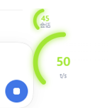
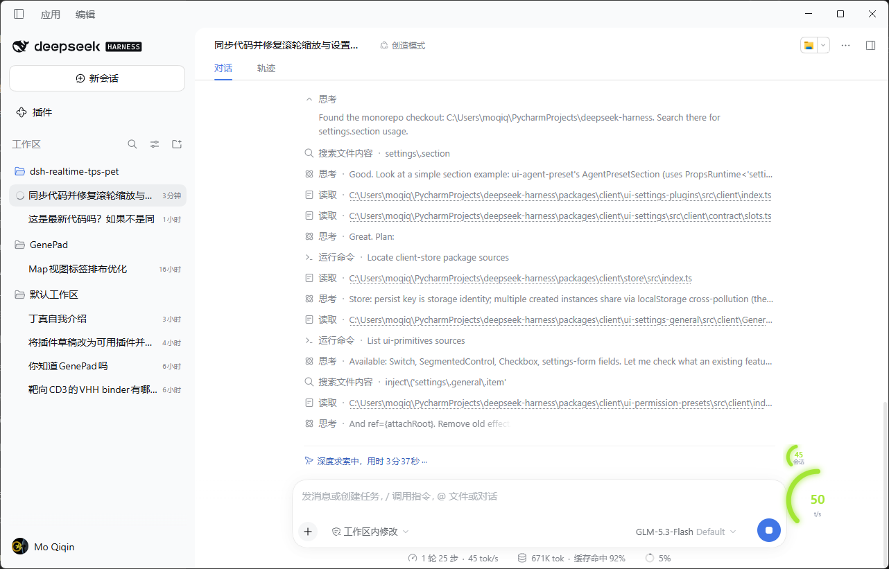

# dsh-realtime-tps-pet

[中文](README.md) | **English**

A live output-speed floating window for [DeepSeek Harness](https://github.com/deepseek-ai/deepseek-harness) (DSH): one draggable overlay in three forms — an **animated pet** (default 小肥鱼, plus 月薪喵 and a vector-drawn 小机器人), a **ring gauge**, and a compact speed **capsule**.

> [!TIP]
> **A ZCode user? Head to [zcode-speed-panel](https://github.com/Masterchiefm/zcode-speed-panel)** — the desktop (Tauri) counterpart of this plugin for the ZCode CLI: the same pet / mini-gauge / capsule floating forms (this plugin's pet choreography was ported from it), plus daily token usage and system-wide network monitoring.

## Screenshots

| Pet | Capsule | Ring gauge |
|:---:|:---:|:---:|
|  |  |  |
|  |  |  |

## Install

### Method 1 — let DeepSeek install it (recommended)

Paste this sentence into a DeepSeek Harness workspace and send it:

> 查阅 https://github.com/masterchiefm/dsh-realtime-tps-pet 项目地址，根据里面内容安装 deepseek-harness 插件。若网络不佳，请善用用户本地的代理服务或者镜像源。

DeepSeek reads this README, verifies the prerequisites, and runs the install for you.

### Method 2 — manual install

**Via the UI:** Settings → Plugins → install from URL / repository, and enter:

```
https://github.com/masterchiefm/dsh-realtime-tps-pet
```

**Via the CLI:**

```bash
dsh plugin install https://github.com/masterchiefm/dsh-realtime-tps-pet
```

Add `--profile <name>` if you use a named profile (the default desktop profile needs no flag). Restart DSH (or refresh the page) after installing; the pet appears over the main-view conversation once a session is bound.

**Prerequisites:** DSH ≥ 0.2.0-rc.2 with the web (desktop) profile. No API keys, no extra services — the plugin is a read-only view over the session's own streaming events.

## How it reads speed

While a step streams the client only receives text deltas, so the live figure counts **estimated** tokens over a rolling 15 s window anchored on the newest delta. Every settled call contributes its reported-over-estimated ratio; the median of the last 8 calibrates the estimate, and the figure carries `≈` until the first sample arrives.

The average is **exact**: the adapter's own output tokens over the decode wall time, with the window running from the first non-empty delta to the `assistant/message` that settled the step — the same pair the built-in statistics (`sessionStats`) fold:

- **whole session**: Σ output tokens ÷ Σ decode time, handed over by the host projection; the window only displays it.
- **latest call**: the same formula over the most recent completed call alone.

## Forms

| Form | What it shows |
|---|---|
| Pet | Sprite (or vector) animation by speed band; bubble above the head with live + the chosen average (hover, or always-on by default; it stays up with an honest 0 while the session runs) |
| Ring gauge | The big ring is the live reading, eased and band-colored; the small ring at its top-left shows the chosen average |
| Capsule | Live figure (idle falls back to the average, dimmed) + an average line |

## Settings

Right-click the window for quick switches; **Settings → Speed pet** offers the full page: window form, average scope, pet pack, a size slider (0.6×–2×), and the always-on-average and hide-while-idle toggles. Hovering the window and scrolling the wheel resizes it too; every preference persists.

**Update check:** the plugin reads this project's latest GitHub release tag (at most once per 6 hours) and compares it with the local version. When a newer release exists, a "New version available — click to install" entry appears at the top of the right-click menu, and the settings page shows an install button. Clicking install copies `dsh plugin install <repo>` to the clipboard and opens the release page — paste it into the workspace (or reinstall via Settings → Plugins) to upgrade; you can also skip that version.

## Development

`lib/` ships prebuilt. Building from source happens inside the DeepSeek Harness monorepo (the client bundle format, CSS-modules inlining, and sprite-sheet inlining all come from its `tsdown` preset); `src/` is included for reading and patching. The sprite sheets live in `assets/pets/` (`*.orig.webp` are the untouched originals).

Attribution for the pet packs and the ported gauge/animation behavior: see [THIRD-PARTY-NOTICES.md](THIRD-PARTY-NOTICES.md).

## License

[MIT](LICENSE) © masterchiefm
