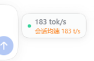
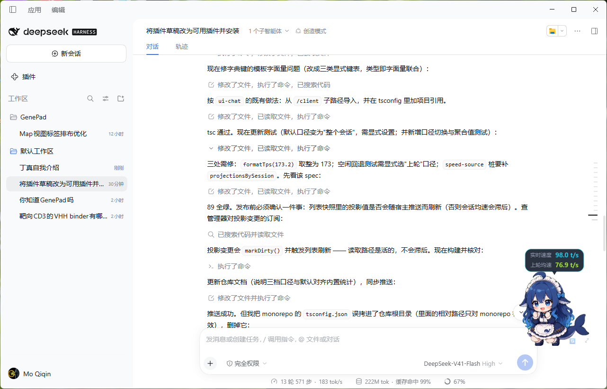
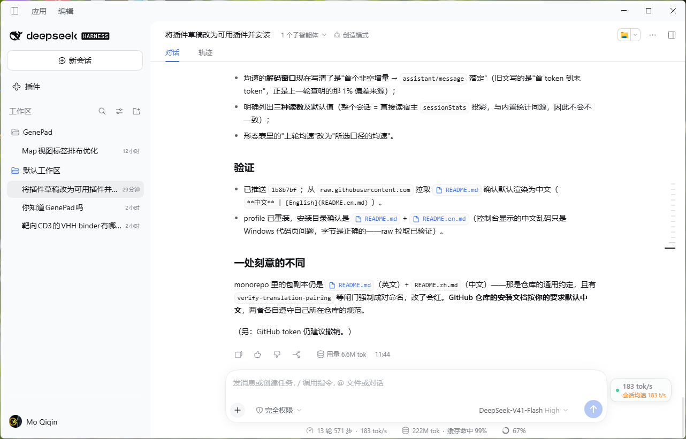

# dsh-realtime-tps-pet

**中文** | [English](README.en.md)

[DeepSeek Harness](https://github.com/deepseek-ai/deepseek-harness)（DSH）的实时输出速度悬浮窗：一个可拖动的窗口，三种形态——**桌宠**（默认小肥鱼，另含月薪喵与矢量绘制的小机器人）、**环形仪表**与紧凑的**速度胶囊**。

- 流式期间实时显示 tok/s，六档速度分档配色；在校准样本到来之前数字带 `≈` 标记。
- 三种形态都显示**均速**，读数由右键菜单选择：
  - **整个会话（默认）**——应用自己的数字，直接读宿主的 `sessionStats` 投影：所有上报用量的步骤的**输出 token 之和 ÷ 解码墙钟时间之和**。与内置会话统计条完全同口径（宿主按全日志计算，不受分页与压缩影响），因此两者不会出现差异。
  - **上轮（最近一次调用）**——最近一次已完成调用的输出 token ÷ 该次解码时长（首 token → 消息落定）。
  - **上步（最近一次调用）**——同一个数值；一步 = 轮内单次模型调用。
- **会话未结束时不回待机**：命令或工具正在执行、没有步骤在流式时，气泡保持显示并如实写 `0.0`。
- 桌宠动画安排移植自 zcode-speed-panel：当前行动画整行播完才切换、速度档位选行、最高两档左右来回跑每遍换向；矢量小机器人走同一套动画表。
- **滚轮缩放**：鼠标悬停在窗口上滚动即可调节大小（0.6×–2×，自动记住）。
- 可拖到任意位置；右键菜单切换形态、换宠物、切换均速口径、常显均速、空闲隐藏；双击或回车循环形态；摆放与形态持久化。

## 截图

| 桌宠 | 胶囊 |
|:---:|:---:|
|  |  |
|  |  |

## 安装

### 方式一（推荐）—— 让 DeepSeek 帮你装

把下面这句话粘贴到 DeepSeek Harness 的工作区并发送：

> 查阅 https://github.com/masterchiefm/dsh-realtime-tps-pet 项目地址，根据里面内容安装 deepseek-harness 插件。若网络不佳，请检测用户本地的代理服务或者利用镜像源。

DeepSeek 会阅读本 README、核对前置条件，然后替你执行安装。

### 方式二 —— 手动安装

**界面：** 设置 → 插件 → 通过 URL / 仓库安装，填入：

```
https://github.com/masterchiefm/dsh-realtime-tps-pet
```

**命令行：**

```bash
dsh plugin install https://github.com/masterchiefm/dsh-realtime-tps-pet
```

使用命名 profile 时加 `--profile <名称>`（默认 desktop profile 无需加）。安装后重启 DSH（或刷新页面）；绑定会话后桌宠出现在主视图会话上方。

**前置条件：** DSH ≥ 0.2.0-rc.2，web（桌面）profile。不需要 API key、不依赖额外服务——插件只是会话自身流式事件的只读视图。

## 速度口径

流式期间客户端只能拿到文本增量，所以实时读数在锚定于最新增量的 15 秒滚动窗口上积分**估算** token；每个已完成调用贡献一次"报告值 ÷ 估算值"之比，最近 8 个样本的中位数用于校准，首个样本到来之前数字带 `≈` 标记。

均速则是**精确**的：用适配器上报的输出 token 除以解码墙钟时间。窗口的右端是 `assistant/message` 落定时刻（不是最后一个增量），左端是首个非空增量——这与内置统计（`sessionStats`）的折叠完全一致：

- **整个会话**：`Σ输出token ÷ Σ解码时长`，由宿主的投影直接给出，窗口只是把它显示出来；
- **最近一次调用**：同一条公式，但只取最近一次已完成调用。

## 形态

| 形态 | 显示内容 |
|---|---|
| 桌宠 | 按速度档位播放的精灵/矢量动画；头顶**上方**的气泡显示实时 + 均速（悬停展开，默认常显；会话未结束时保持显示并如实写 0） |
| 环形仪表 | **大环是实时速度**（缓动、分档变色），左上角小环显示所选口径的均速 |
| 胶囊 | 实时数字（空闲时回落到均速、暗淡）+ 均速一行 |

## 开发说明

`lib/` 为预构建产物。从源码构建在 DeepSeek Harness 单仓库内进行（客户端 bundle 格式、CSS Modules 内联与精灵图内联都来自其 `tsdown` 预设）；`src/` 附上供阅读与修补。精灵图位于 `assets/pets/`（`*.orig.webp` 为未改动的原始素材）。

宠物包素材与移植的仪表/动画行为的归属说明见 [THIRD-PARTY-NOTICES.md](THIRD-PARTY-NOTICES.md)。

## 许可

[MIT](LICENSE) © masterchiefm
